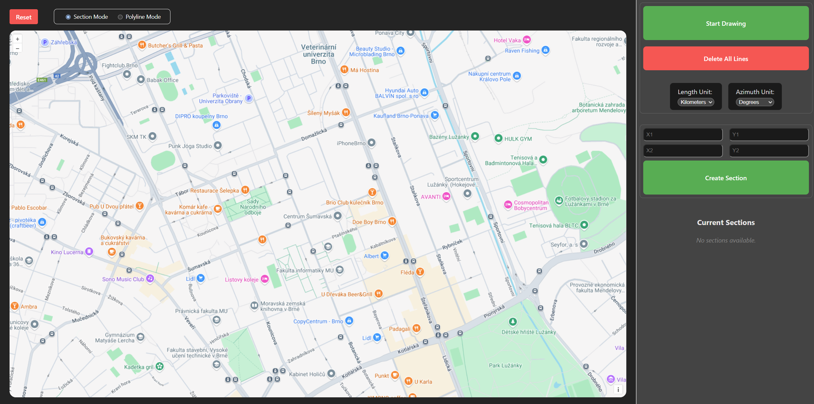

# Map tool

## How to run

### Run remotely
[Map tool online](https://ondrejkukla.github.io/map-tool/)

### Run locally
`git clone https://github.com/ondrejkukla/map-tool.git`

`npm install`

`npm run dev`

## Description

- Select mode - `Sections` and `Polylines`
- Click `Start Drawing` button to enable drawing mode
    - Hover over the map and create a  curve (`Right mouse button` / `Stop Drawing` button will end the action)
        * OR
    - Click Stop Drawing button and fill coordinates manually (`x=longtitude` `y=lattitude`)
        *  *Coordinates of Brno x = 16.6068 y = 49.1951 as an example*

## Preview

